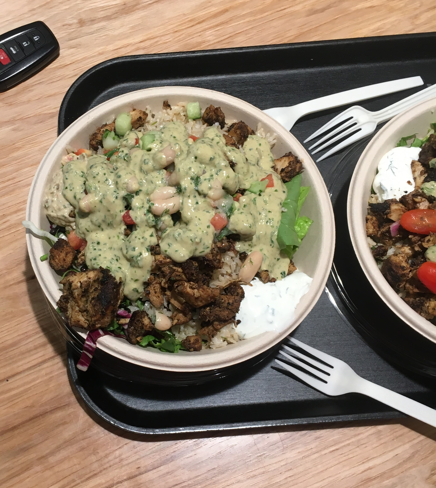

# 👋 Hi, I’m **Kojo S Kusi**

I’m a physician from Ghana currently pursuing my MPH at Johns Hopkins. I care about improving health outcomes through better clinical trials and research on chronic diseases in Africa.

---

## 🌟 Something I enjoy

Here’s something that brings me joy: The best salad I ever had. My uncle got it for me in Philly!

{width=400px fig-align="center"}

---

## ⚡ Fun Facts
- I love Jesus.  
- I’m into headphones, smartwatches, and telescopes (though I don’t own one yet!).  
- My favorite paradoxes are the **Omnipotence paradox** and the **Sleeping Beauty paradox**.  
- **Christopher Nolan** is my favorite director — held off watching *Oppenheimer* just to see it in IMAX.  
- Huge **Liverpool/Steven Gerrard** fan ⚽ #YNWA!!  
- I once wanted to become an **Astronomer**.  
- **Tim Duncan** is the GOAT of basketball 🏀.